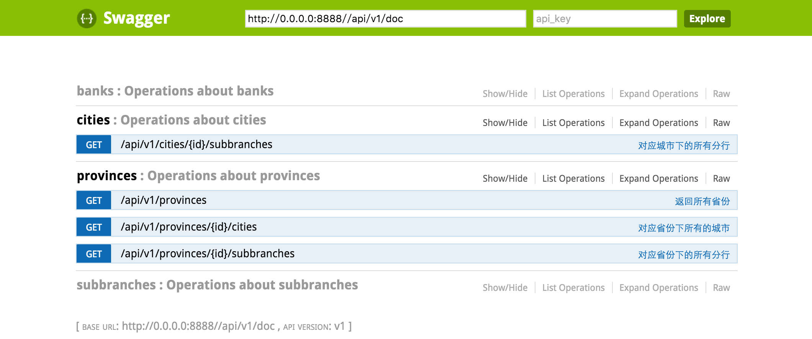

### swagger框架集成到rails项目
1. swagger号称是世界上最流行的api框架(The World's Most Popular Framework for APIs).
2. Gemfile文件加入必须的gem：
   <pre><code>
    gem 'grape'
   	gem 'grape-swagger', '~> 0.10.2'
	gem 'grape-swagger-rails', '~> 0.1.0'
   </code></pre>
3. 修改config/routes.rb文件，增加 mount GrapeSwaggerRails::Engine => '/apidoc'
   <pre><code>  
	Rails.application.routes.draw do
	  mount Api => '/'
	  mount GrapeSwaggerRails::Engine => '/apidoc'
	end
   </code></pre> 
4. 将swagger-rails.rb文件加到config/initializers/目录下，具体内容：
   <pre><code>
   	GrapeSwaggerRails.options.url      = "/api/v1/doc"
    GrapeSwaggerRails.options.app_url  = '/'

	if Rails.env.production?
	  GrapeSwaggerRails.options.before_filter do |request|
    	authenticate_or_request_with_http_basic do |username, password|
     	 	username == 'username' && password == 'xxxx'
      	end
  	  end
    end
   </code></pre>
5. api.rb文件添加到app/grape目录下，引入grape-swagger，具体内容:
   <pre><code>
   	  require "grape-swagger"
        class Api < Grape::API
        helpers ErrorHelpers
        mount ::V1::Root
      end
   </code></pre>
6. 比如有v1版本users的接口(app/grape/v1)，在v1文件夹下增加root.rb文件，具体内容：
   <pre><code>
   module V1
  class Root < Grape::API

    prefix 'api'
    version 'v1'
    format :json
    content_type :json, "application/json;charset=UTF-8"
    formatter :json, Grape::Formatter::Rabl

    mount V1::users

    add_swagger_documentation(
      api_version: 'v1',
      mount_path: 'doc',
      hide_documentation_path: true,
      hide_format: true
    )
  end
end
   </code></pre>
7. 重新部署项目，输入url: http://url/apidoc，就能看到如下页面，写完手工！
    
   